# 🔄 Sequence Diagrams & Data Flow - Clustr App

## 🔐 Authentication Flow Sequence

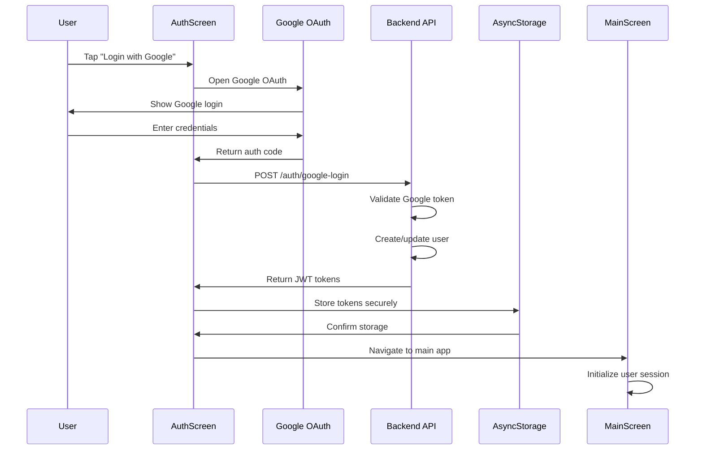

### **Authentication State Flow**
```
User Action: "Login with Google"
    ↓
AuthScreen: setLoading(true)
    ↓
Google OAuth: Request permissions
    ↓
Backend API: Validate & create user
    ↓
AsyncStorage: Store JWT tokens
    ↓
App State: Set authenticated user
    ↓
Navigation: Redirect to MainScreen
```

---

## 📱 Event Discovery & Join Flow

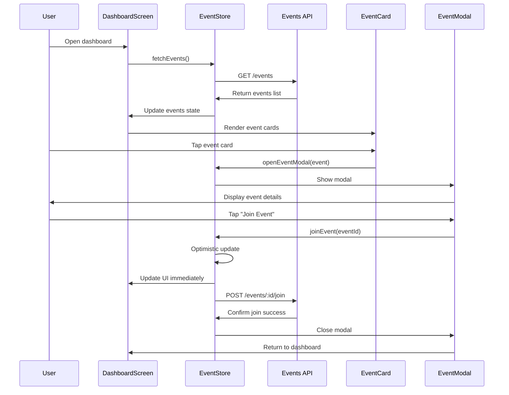

### **Event Join State Flow**
```
User Action: "Join Event"
    ↓
EventStore: Add to joiningEvents set (loading state)
    ↓
EventStore: Optimistic update (event.isJoined = true)
    ↓
UI: Show joined state immediately
    ↓
API Call: POST /events/:id/join
    ↓
Success: Remove from joiningEvents set
    ↓
Error: Rollback optimistic update + show error
```

---

## 💬 Real-time Chat Flow

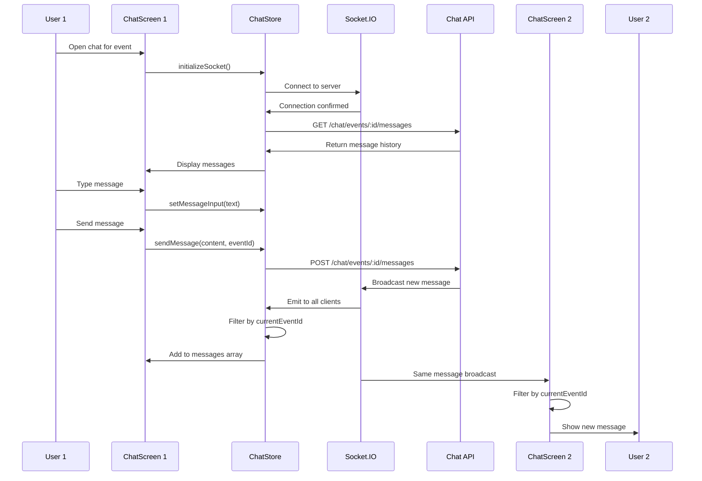

### **Real-time Message State Flow**
```
User Action: "Send Message"
    ↓
ChatStore: setMessageInput('') (clear input)
    ↓
API Call: POST /chat/events/:id/messages
    ↓
Backend: Save to database
    ↓
Socket.IO: Broadcast to all clients
    ↓
Frontend: Filter by event_id
    ↓
ChatStore: Add to messages array
    ↓
UI: Display new message with animation
```

---

## 🔔 Notification Flow

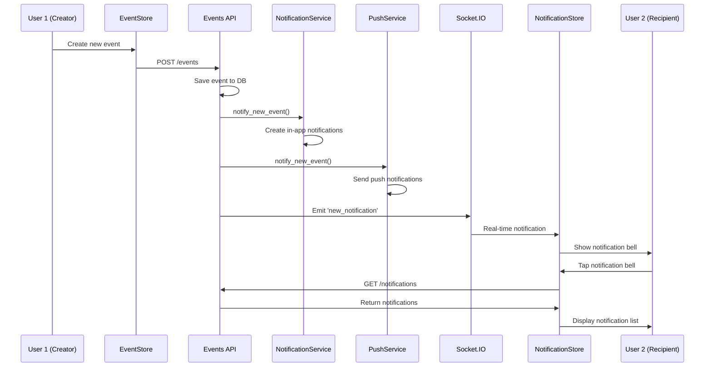

### **Notification State Flow**
```
Event Created
    ↓
Backend: Create notification records
    ↓
Push Service: Send to user devices
    ↓
Socket.IO: Broadcast to connected clients
    ↓
NotificationStore: Update unread count
    ↓
UI: Animate notification bell
    ↓
User Interaction: Open notification modal
    ↓
API: Fetch detailed notifications
    ↓
UI: Display notification list
```

---

## 🎛️ State Management Data Flow

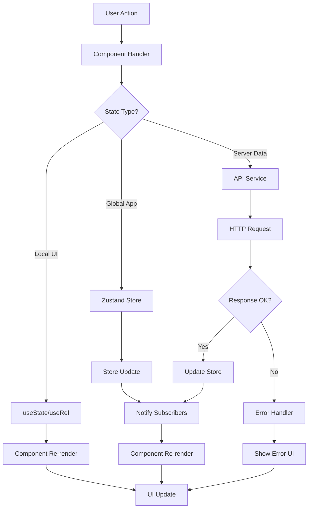

### **Store-to-Component Data Flow**
```
Store State Change
    ↓
Zustand: Notify subscribers
    ↓
Component: Check if subscribed state changed
    ↓
React: Schedule re-render if changed
    ↓
Component: Re-render with new state
    ↓
UI: Update visual elements
```

---

## 🔄 Optimistic Update Pattern

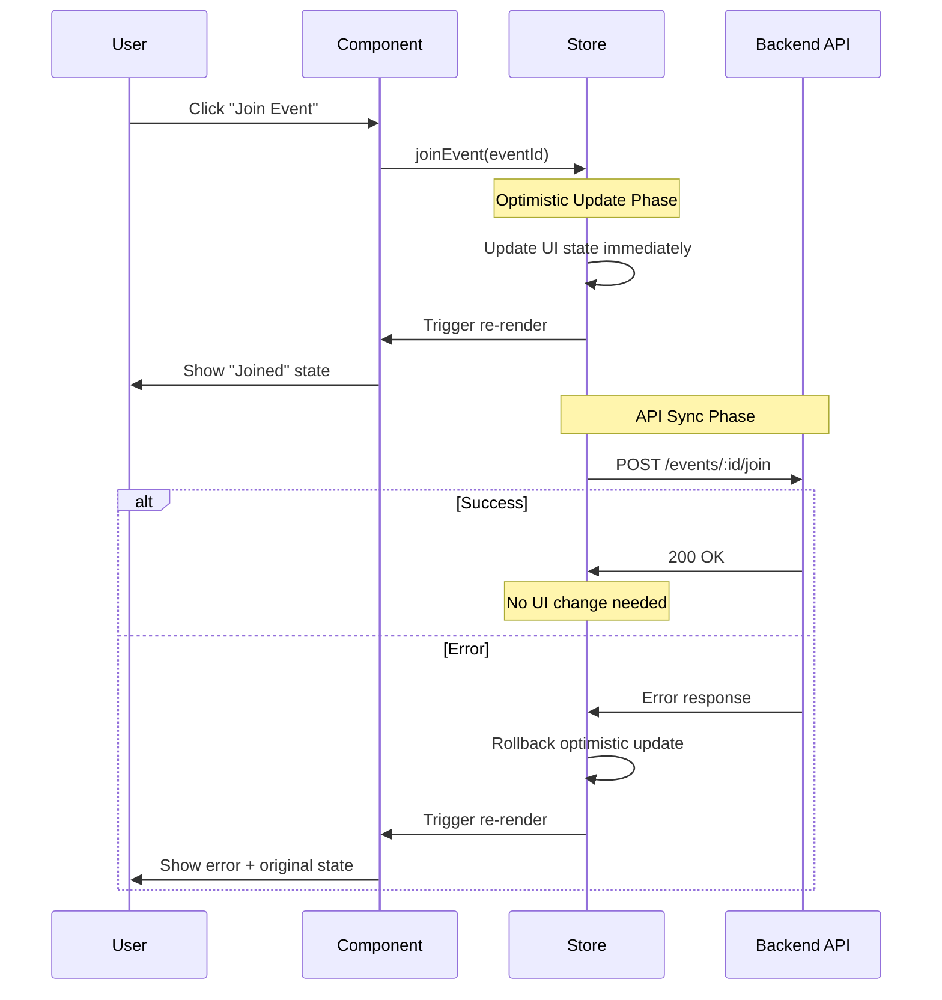

### **Optimistic Update State Flow**
```
User Action
    ↓
Immediate UI Update (Optimistic)
    ↓
API Call (Background)
    ↓
Success: Keep optimistic state
    ↓
Error: Rollback + show error message
```

---

## 📱 Modal Management Flow

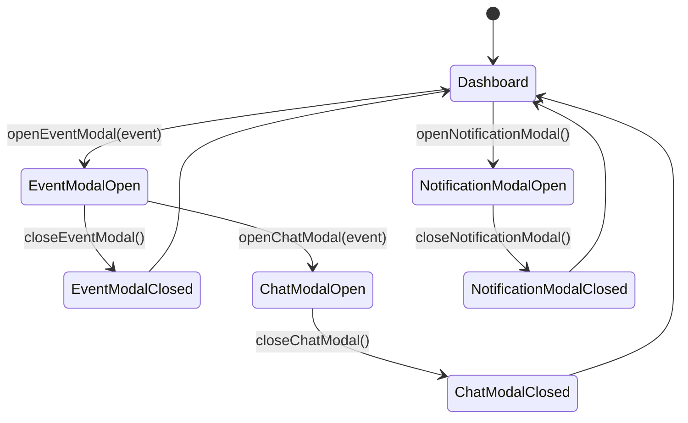

### **Modal State Transitions**
```
Dashboard (Base State)
    ↓ [User taps event card]
Event Modal Open
    ↓ [User taps "Open Chat"]
Chat Modal Open (Event modal closes)
    ↓ [User closes chat]
Dashboard (Back to base)
```

---

## 🔌 Socket.IO Connection Flow

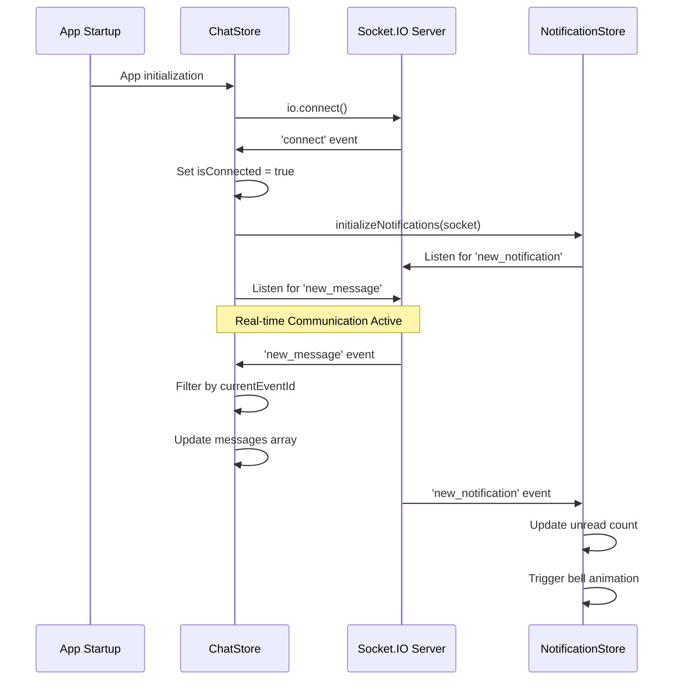

### **Socket Connection State Flow**
```
App Start
    ↓
ChatStore: Initialize socket connection
    ↓
Socket.IO: Connect to server
    ↓
Server: Send connection confirmation
    ↓
ChatStore: Register event listeners
    ↓
NotificationStore: Register notification listeners
    ↓
Real-time communication active
```

---

## 🎨 Component Lifecycle & State

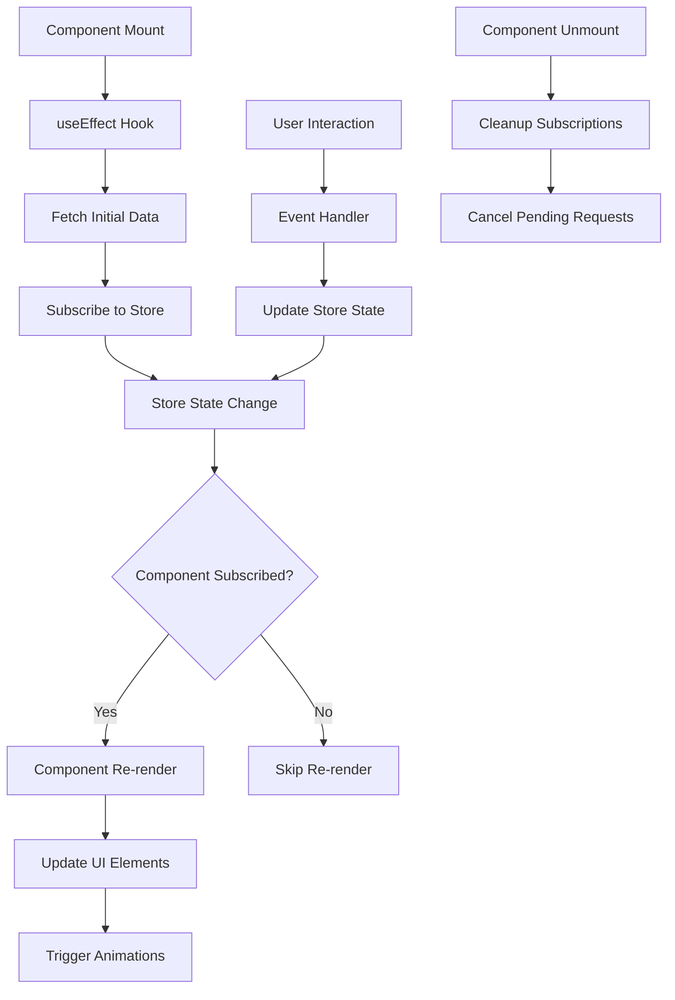

### **Component-Store Interaction Pattern**
```
Component Mount
    ↓
Subscribe to store slices
    ↓
Store state changes
    ↓
Component checks if subscribed state changed
    ↓
Re-render if changed
    ↓
Update UI with new state
    ↓
Component unmount
    ↓
Cleanup subscriptions
```

---

## 🔄 Error Handling Flow

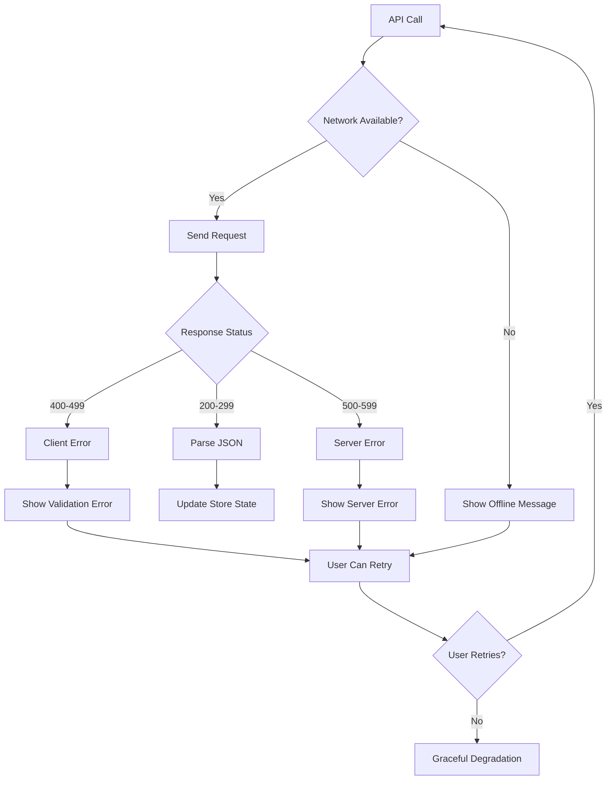

### **Error Recovery State Flow**
```
API Error Occurs
    ↓
Categorize error type (network, client, server)
    ↓
Show appropriate error message
    ↓
Provide retry mechanism
    ↓
User chooses to retry or continue
    ↓
Retry: Repeat API call
    ↓
Continue: Show cached/default content
```

---

## 📊 Performance Optimization Flow

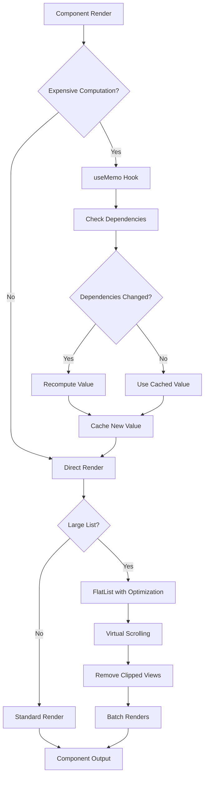

### **Performance Optimization Pattern**
```
Component renders
    ↓
Check for expensive operations
    ↓
Apply memoization (useMemo, React.memo)
    ↓
Use optimized list rendering (FlatList)
    ↓
Enable native driver animations
    ↓
Result: Smooth 60fps performance
```

---

*These sequence diagrams illustrate the complex data flows and state management patterns that make the Clustr app responsive and reliable. Each flow is designed for optimal user experience and system performance.*
